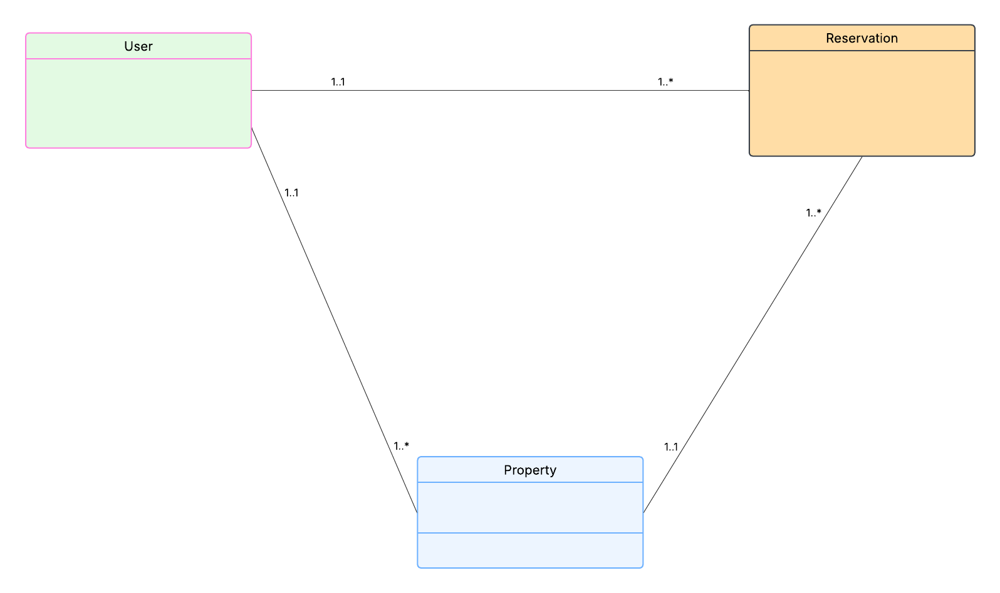

# Immo Plus API project

This project is a REST API build using Java, SpringBoot, H2 and Maven.

It allows :
- to create users with roles
- to get all users 
- to get user by id
- to create real estate
- to update real estate
- to get all real estates
- to get real estate by id
- to delete real estate by id
- to create reservation
- to get reservation by id
- to get all reservations

## Diagramme des classes
